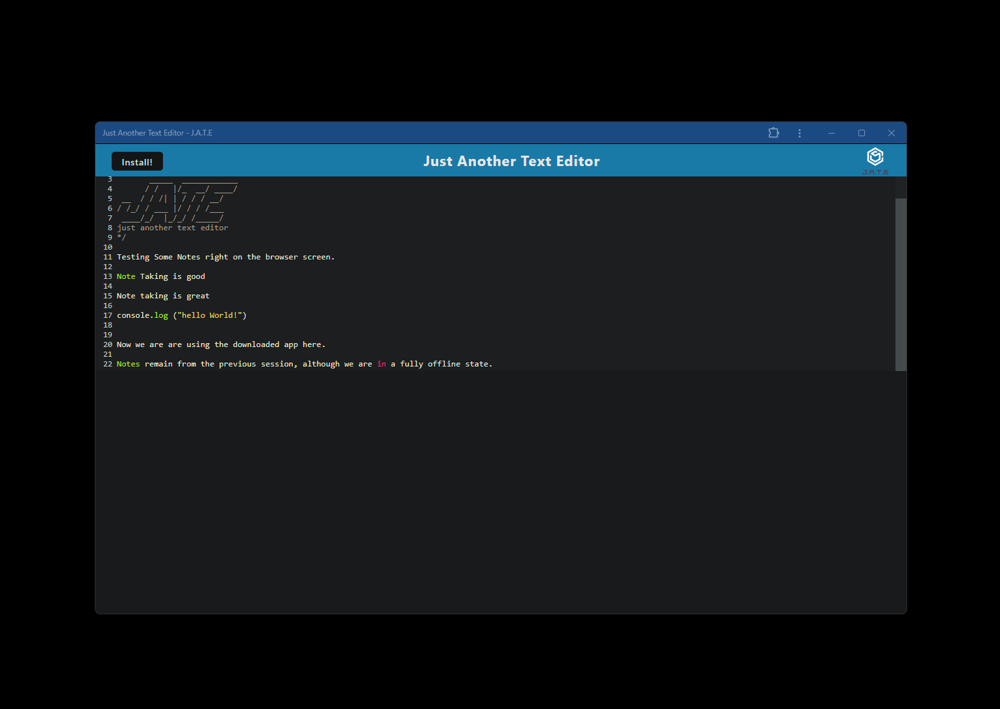

# Text Editor
  

## Description

If you are like me, you are in constant need of some form of taking notes.  But sometimes when you are restricted to using only digital means the options for how to take those notes are not so great.  This app gives you another text editor that you will be able to install and use even when offline. No need to fear if you are changing platforms, as this web based text editor will be accessible and allow you the ability to keep that text at your side. This app also served as a way to experience and play around with PWA structures.

## Table of Contents

- [Installation](#installation)
- [Usage](#usage)
- [License](#license)
- [Contributing](#contributing)
- [Tests](#tests)
- [Questions](#questions)

## Installation

This app is run as an application that you can either use on the browser page, or install or your own system.  Simply navigate to the provided deployed link.  And if you wish to install it on your own system, click on install.  

## Usage

It's a simple text editor.  You can just jot down a single page of text right in that browser/app window.  

Check out the deployed [render page](https://slem-text-editor.onrender.com//) to check out the text editor!

## 

## 

## License

This project is licensed under the MIT license. Click [here]([MIT License](https://opensource.org/licenses/MIT)) for more details.

## Contributing

No collaborators

## Tests

Tests are not required for this project.

## Questions

If you have any questions, please contact me:

- GitHub: [slemjosh](https://github.com/slemjosh)
- Email: [joshua.slem@gmail.com](mailto:joshua.slem@gmail.com)